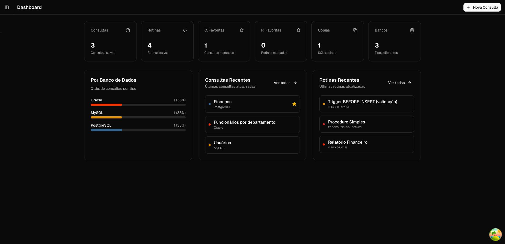
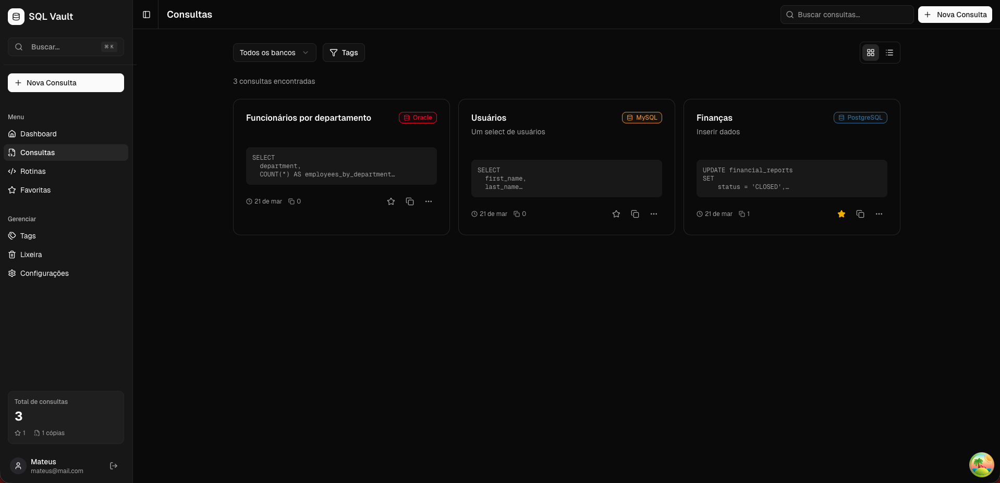
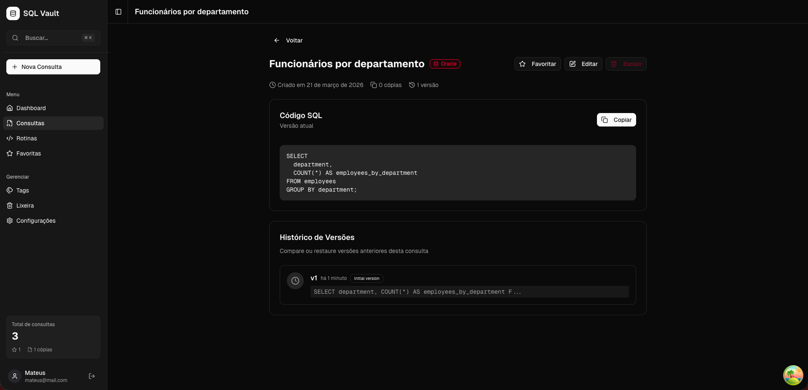
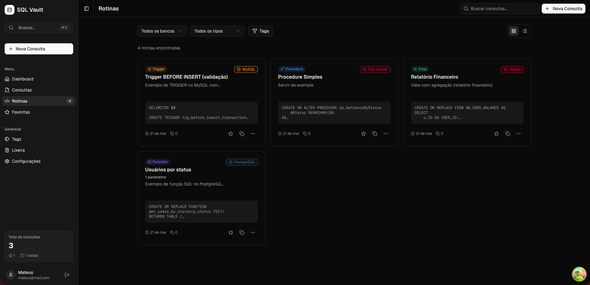
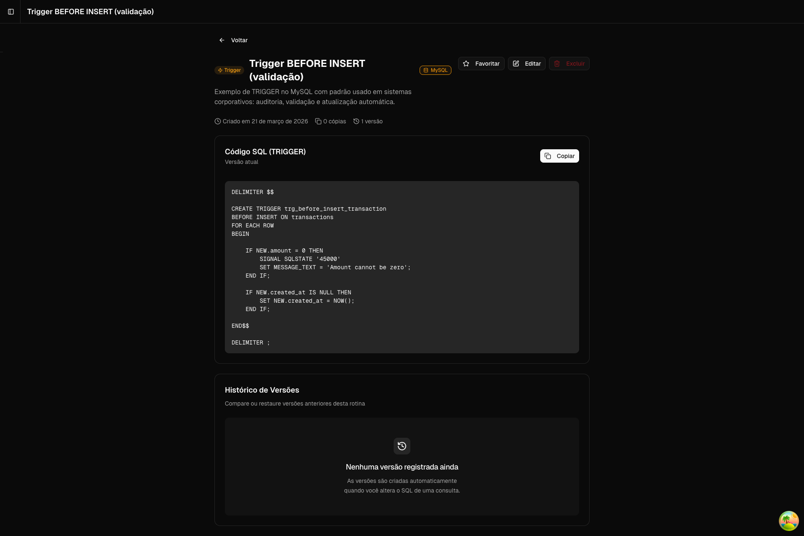
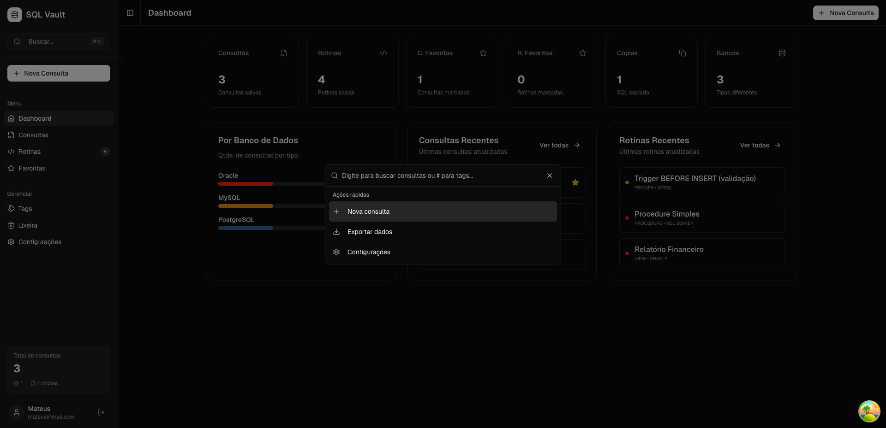
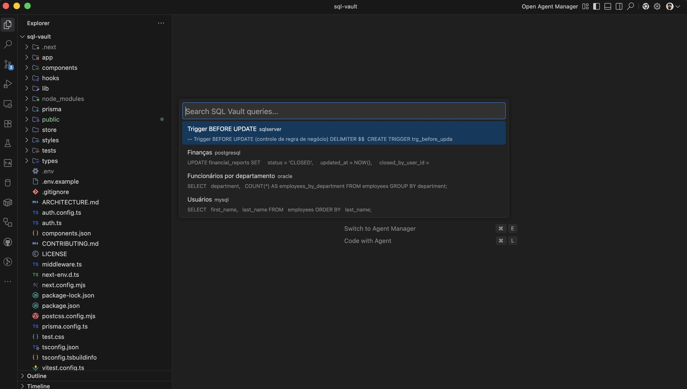
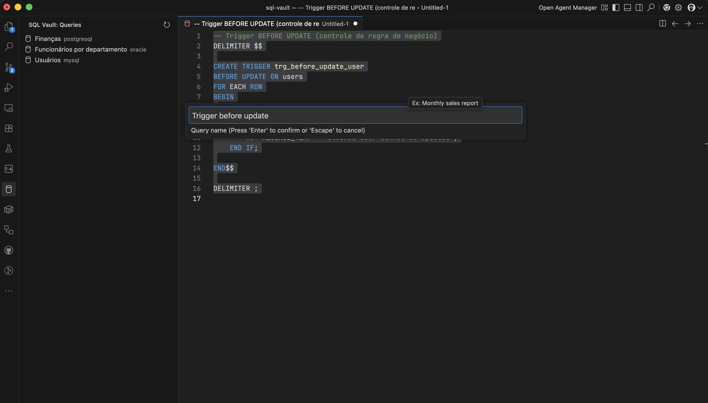
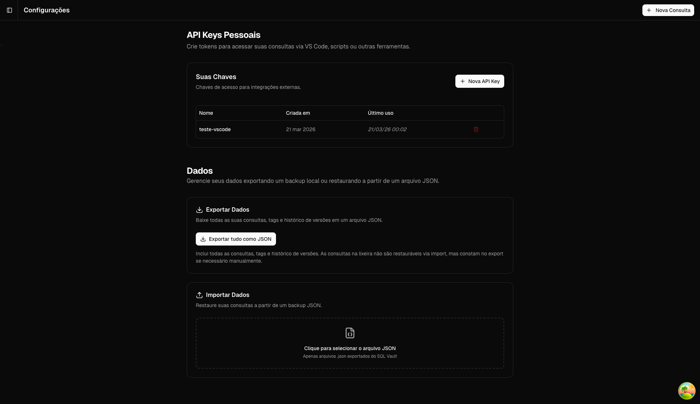

<div align="center">
  
  <br />
  <br />
  <a href="https://opensource.org/licenses/MIT">
    
  </a>
  <a href="https://marketplace.visualstudio.com/items?itemName=mateusarcedev.sqlvault">
    
  </a>
  <p><i>A local-first vault for SQL queries with versioning, tags, and VS Code integration</i></p>
</div>

> Language: **English** | [Português (Brasil)](README.md)

## Features

* 🗄️ SQL query management with tags, favorites, and soft delete
* ⚙️ Routines: functions, procedures, triggers, and views with parameters
* ⏳ Version history with side-by-side diff via Monaco Editor
* 📦 JSON (v1/v2) and `.sql` export/import
* 🔍 Global command palette `Cmd+K`
* 🤖 Per-provider AI configuration (OpenAI, Anthropic, Gemini, Ollama) with dynamic model lists
* 🔎 Searchable model picker (combobox) in settings
* 🧩 Tabbed Settings page (API Keys, AI, Data)
* 🔑 Personal API keys for external integrations
* ♻️ Secure API key regeneration (raw token shown only at create/regenerate time)
* 💻 VS Code extension to search and save queries from the editor

## Screenshots


<br />
<em>Dashboard metrics</em>
<br /><br />


<br />
<em>Queries list</em>
<br /><br />


<br />
<em>Query details with version history</em>
<br /><br />


<br />
<em>Routines list</em>
<br /><br />


<br />
<em>Routine details</em>
<br /><br />


<br />
<em>Command palette (Cmd+K)</em>
<br /><br />

### VS Code Extension


<br />
<em>VS Code: search query</em>
<br /><br />


<br />
<em>VS Code: save query</em>
<br /><br />

### Settings


<br />
<em>Settings (API Keys + Export/Import)</em>
<br /><br />

## Tech Stack

| Technology | Purpose |
| --- | --- |
| Next.js 16 (App Router) | Framework to build the React app with API routes and server/client component boundaries. |
| TypeScript | Strong typing across the app for safer contracts and fewer runtime errors. |
| Prisma | Type-safe ORM for database access, migrations, and schema generation. |
| SQLite | Primary local database for zero-config persistence. |
| NextAuth v5 | Auth/session management with secure cookies and bcrypt password verification. |
| next-intl | Internationalization with locale-based routing and pt-BR/en message catalogs. |
| TanStack Query | Remote state, caching, background refetch, and cache invalidation. |
| Zustand | Lightweight global UI state management. |
| shadcn/ui | Accessible, customizable component system based on Radix UI. |
| Tailwind CSS | Utility-first styling directly in React components. |
| Monaco Editor | SQL editor with syntax highlighting and advanced editing capabilities. |

## Getting Started

**Requirements:**
- Node.js 18+
- npm

**Install:**
```bash
git clone https://github.com/mateusarcedev/sql-vault.git
cd sql-vault
cp .env.example .env
# Edit .env and set AUTH_SECRET with: openssl rand -base64 32
npm install
npx prisma migrate dev
npm run dev
```

Open `http://localhost:3000`, create your account, and start using it.

## VS Code Extension

```bash
ext install mateusarcedev.sqlvault
```

**Setup:**
1. Generate an API key in `Settings → API Keys`
2. Run `SQL Vault: Configure API Key` in VS Code
3. Paste the token when prompted

**Usage:**
- `Cmd+Shift+S` — search and insert query at cursor
- Right-click selected SQL → **SQL Vault: Save Selected SQL**

Available on [VS Code Marketplace](https://marketplace.visualstudio.com/items?itemName=mateusarcedev.sqlvault)

## Project Structure

```text
├── app/
│   ├── (auth)/   - Public unauthenticated entry routes.
│   ├── (app)/    - Main authenticated application routes.
│   └── api/      - REST endpoints for business logic and resources.
├── components/   - Reusable UI components (buttons, inputs, layout primitives).
├── store/        - Zustand domain stores (query, routine, ui).
├── types/        - Global TypeScript types and interfaces.
├── lib/          - Core helpers, utilities, and system singletons.
└── prisma/       - Schema definitions, migrations, and SQLite database.
```

## Contributing

Read `ARCHITECTURE.md` and `CONTRIBUTING.md`.
Full contribution guidelines: [CONTRIBUTING.md](CONTRIBUTING.md)

## License

MIT — Mateus Arce
