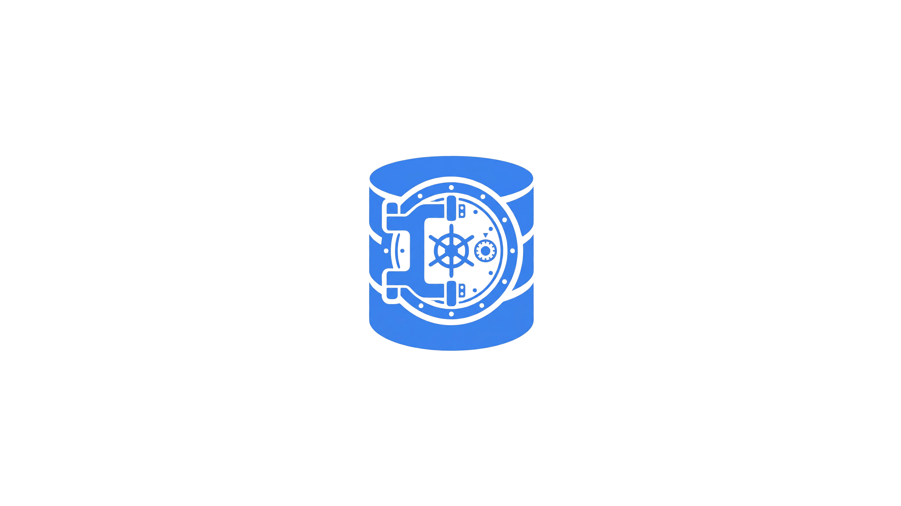
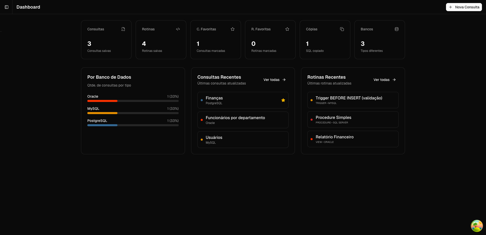
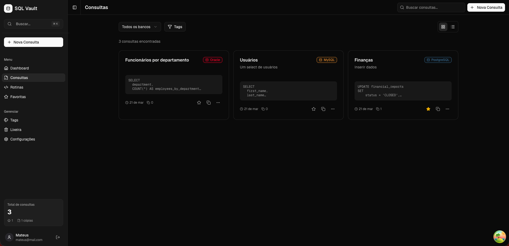
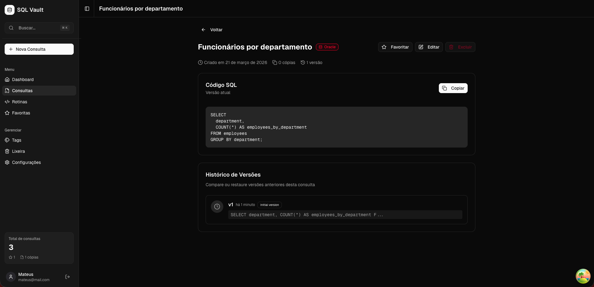
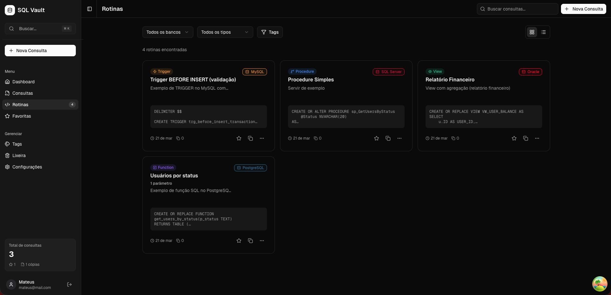
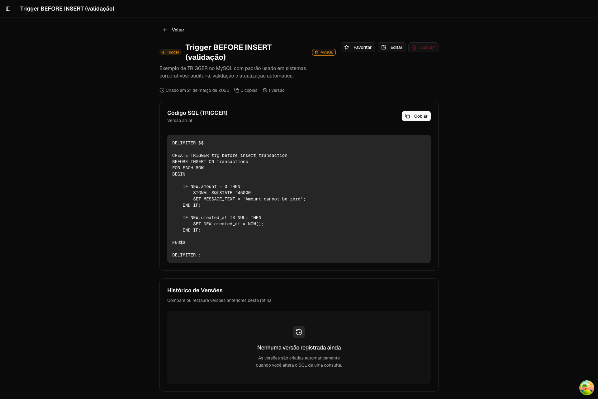
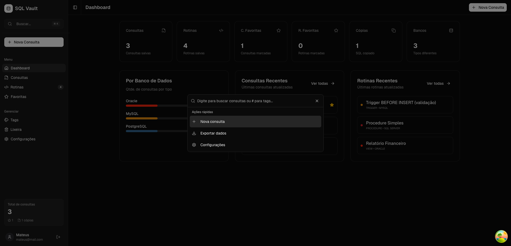
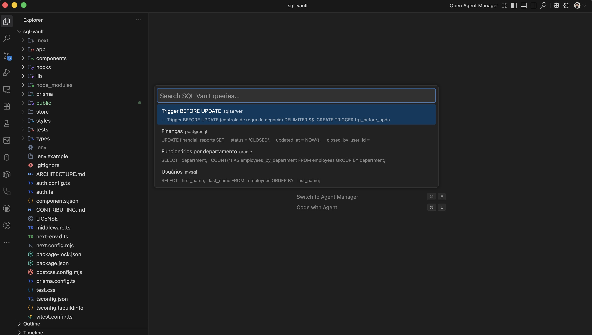
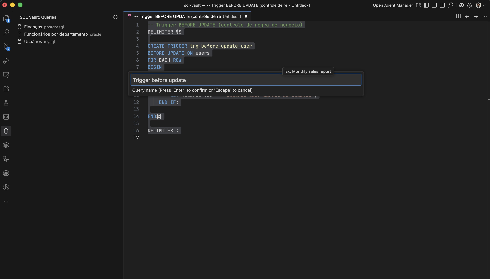
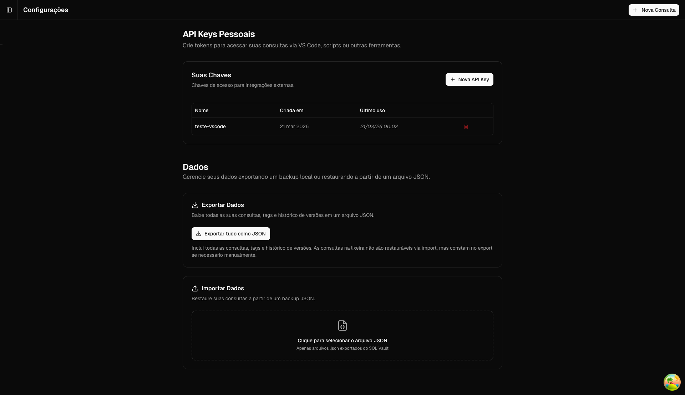

<div align="center">
  
  <br />
  <br />
  <a href="https://github.com/mateusarcedev/sql-vault/actions/workflows/ci.yml">
    
  </a>
  <a href="https://opensource.org/licenses/MIT">
    
  </a>
  <a href="https://marketplace.visualstudio.com/items?itemName=mateusarcedev.sqlvault">
    
  </a>
  <p><i>A self-hosted SQL vault with versioning, security, AI, and VS Code integration</i></p>
</div>

> Language: **English** | [Português (Brasil)](README.md)

## Features

* 🗄️ SQL query management with tags, favorites, and soft delete
* ⚙️ Routines: functions, procedures, triggers, and views with parameters
* ⏳ Version history with side-by-side diff via Monaco Editor
* 📦 JSON (v1/v2) and `.sql` export/import
* 🔍 Global command palette `Cmd+K`
* 🤖 Per-provider AI configuration (OpenAI, Anthropic, Gemini, Ollama) with dynamic model lists
* 🔎 Searchable model picker (combobox) in settings
* 🧩 Tabbed Settings page (API Keys, AI, Data)
* 🔑 Personal API keys for external integrations
* ♻️ Secure API key regeneration (raw token shown only at create/regenerate time)
* 💻 VS Code extension to search and save queries from the editor
* 🔐 AES-256-GCM encryption for AI credentials and hashed API Key authentication
* 🐘 PostgreSQL 17 with one-shot migrations before application startup
* 🛡️ CI with lint, typecheck, tests, build, Docker, CodeQL, gitleaks, and dependency auditing
* 🌐 Self-hosted deployment with Caddy, automatic HTTPS, PostgreSQL backup and restore

## Docker Quick Start

The simplest way to try SQL Vault is to run both the application and PostgreSQL with Docker Compose.

**Requirements:**
- Git
- Docker + Docker Compose
- Node.js 22 LTS only to generate the secret with the command below

```bash
git clone https://github.com/mateusarcedev/sql-vault.git
cd sql-vault
cp .env.example .env
```

Generate both local secrets and paste the values into `AUTH_SECRET` and `AI_ENCRYPTION_KEY` in `.env`:

```bash
node -e "const c=require('crypto'); console.log('AUTH_SECRET='+c.randomBytes(32).toString('base64')); console.log('AI_ENCRYPTION_KEY='+c.randomBytes(32).toString('base64'))"
```

`AI_ENCRYPTION_KEY` protects AI provider credentials at rest with AES-256-GCM. Treat it like `AUTH_SECRET`; changing or losing it makes previously encrypted credentials unreadable.

Start the application:

```bash
docker compose up --build -d
docker compose ps
```

Compose first runs the one-shot `sql-vault-migrate` service. Once it completes successfully and both `sql-vault` and `sql-vault-db` are **healthy**, open:

```text
http://localhost:3000
```

### Optional demo dataset

Populate the project with entirely fictitious data:

```bash
docker compose exec -e ALLOW_DEMO_SEED=true app npm run db:seed:demo
```

Demo login:

```text
Email:    demo@sqlvault.local
Password: DemoVault2026!
```

The seed is **opt-in and idempotent**. It creates no API keys, AI provider keys, external connection strings, personal data, or corporate schemas.

### Basic operations

Follow application logs:

```bash
docker compose logs -f app
```

Stop the containers:

```bash
docker compose down
```

PostgreSQL data persists in the `sql_vault_postgres_data` volume. `docker compose down` preserves it; use `docker compose down -v` only when you intentionally want to delete local data too.

## Local development

To run Next.js on the host while keeping PostgreSQL in Docker:

```bash
cp .env.example .env
docker compose up -d db
npm ci
npm run prisma:generate
npm run db:migrate:deploy
npm run dev
```

Open `http://localhost:3000`.

> **Migration note:** previous versions used SQLite (`prisma/dev.db`). PostgreSQL has its own migration baseline; old SQLite files are not imported automatically.

## Screenshots


<br />
<em>Dashboard metrics</em>
<br /><br />


<br />
<em>Queries list</em>
<br /><br />


<br />
<em>Query details with version history</em>
<br /><br />


<br />
<em>Routines list</em>
<br /><br />


<br />
<em>Routine details</em>
<br /><br />


<br />
<em>Command palette (Cmd+K)</em>
<br /><br />

### VS Code Extension


<br />
<em>VS Code: search query</em>
<br /><br />


<br />
<em>VS Code: save query</em>
<br /><br />

### Settings


<br />
<em>Settings (API Keys + Export/Import)</em>
<br /><br />

## Tech Stack

| Technology | Purpose |
| --- | --- |
| Next.js 16 (App Router) | Framework to build the React app with API routes and server/client component boundaries. |
| TypeScript | Strong typing across the app for safer contracts and fewer runtime errors. |
| Prisma | Type-safe ORM for PostgreSQL access and client generation; the migration CLI runs in a one-shot container separate from the application runtime. |
| PostgreSQL 17 | Primary relational database, run locally through Docker Compose. |
| NextAuth v5 | Auth/session management with secure cookies and bcrypt password verification. |
| next-intl | Internationalization with locale-based routing and pt-BR/en message catalogs. |
| TanStack Query | Remote state, caching, background refetch, and cache invalidation. |
| Zustand | Lightweight global UI state management. |
| shadcn/ui | Accessible, customizable component system based on Radix UI. |
| Tailwind CSS | Utility-first styling directly in React components. |
| Monaco Editor | SQL editor with syntax highlighting and advanced editing capabilities. |

## VS Code Extension

```bash
ext install mateusarcedev.sqlvault
```

**Setup:**
1. Generate an API key in `Settings → API Keys`
2. Run `SQL Vault: Configure API Key` in VS Code
3. Paste the token when prompted

**Usage:**
- `Cmd+Shift+S` — search and insert query at cursor
- Right-click selected SQL → **SQL Vault: Save Selected SQL**

Available on [VS Code Marketplace](https://marketplace.visualstudio.com/items?itemName=mateusarcedev.sqlvault)

## Project Structure

```text
├── app/
│   ├── (auth)/   - Public unauthenticated entry routes.
│   ├── (app)/    - Main authenticated application routes.
│   └── api/      - REST endpoints for business logic and resources.
├── components/   - Reusable UI components (buttons, inputs, layout primitives).
├── store/        - Zustand domain stores (query, routine, ui).
├── types/        - Global TypeScript types and interfaces.
├── lib/          - Core helpers, utilities, and system singletons.
└── prisma/       - PostgreSQL schema definitions and migrations.
```

## Security and quality

The project includes:

- Auth.js authentication with bcrypt;
- SHA-256 API Key authentication with legacy-token migration compatibility;
- AES-256-GCM encryption at rest for OpenAI/Anthropic/Gemini credentials;
- centralized environment validation;
- non-root application container;
- Prisma CLI isolated from the traffic-serving runtime image;
- one-shot migrations before the application starts;
- CI with lint, typecheck, 132 tests, build, Docker health checks, and production-stack validation;
- CodeQL, gitleaks, Dependabot, and dependency auditing;
- PostgreSQL backup and restore validated in CI.

See [SECURITY.md](SECURITY.md) for the security policy.

## Production deployment

For VPS deployment with PostgreSQL + Caddy + automatic HTTPS, see [DEPLOYMENT.en.md](DEPLOYMENT.en.md).

## Contributing

Read [ARCHITECTURE.en.md](ARCHITECTURE.en.md), [CONTRIBUTING.en.md](CONTRIBUTING.en.md), and the security policy in [SECURITY.md](SECURITY.md).

## License

MIT — Mateus Arce
