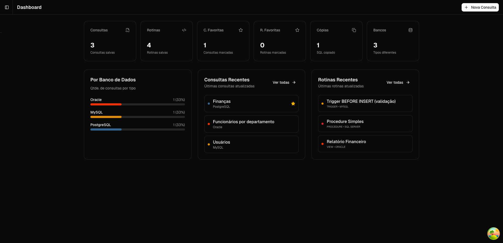
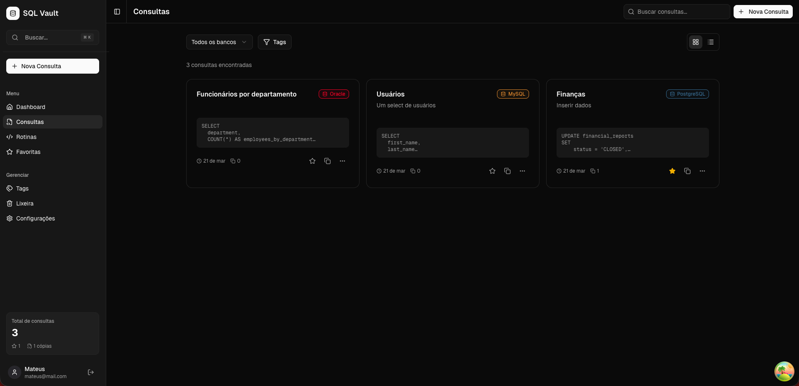
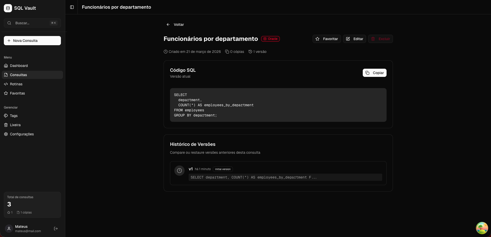
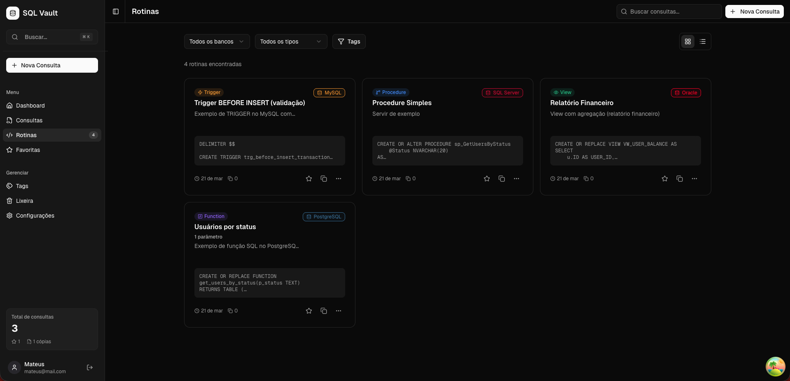
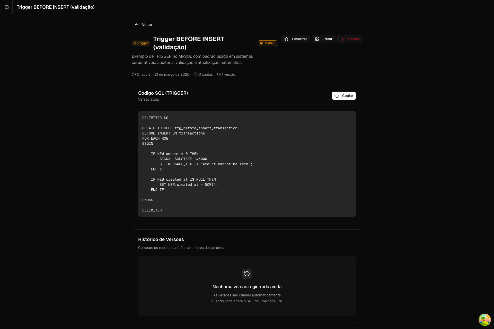
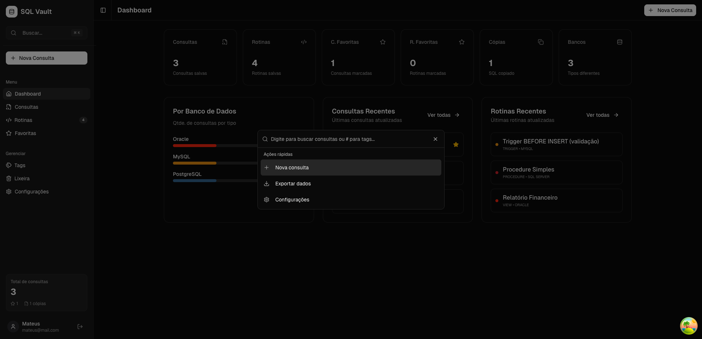
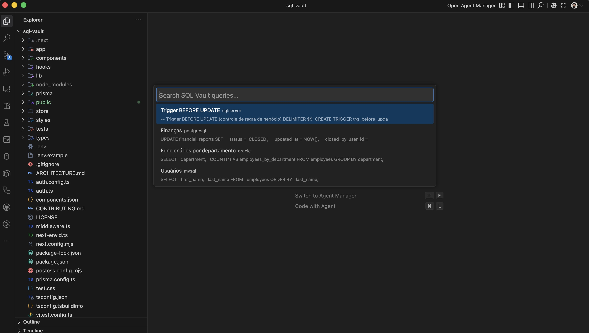
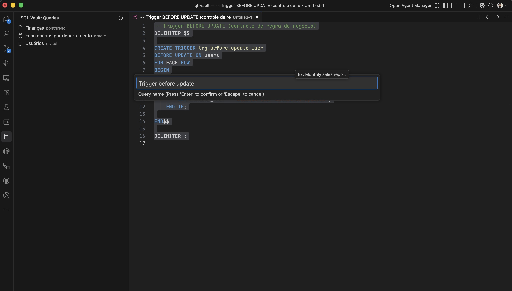
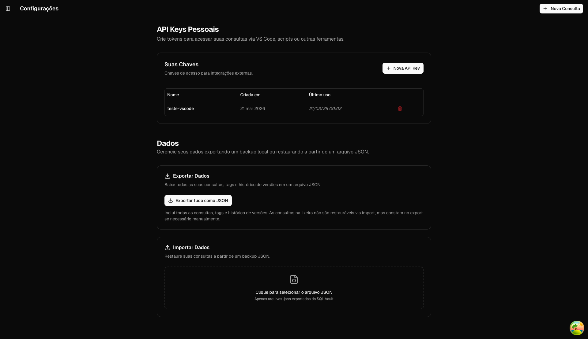

<div align="center">
  
  <br />
  <br />
  <a href="https://opensource.org/licenses/MIT">
    
  </a>
  <a href="https://marketplace.visualstudio.com/items?itemName=mateusarcedev.sqlvault">
    
  </a>
  <p><i>Um cofre local-first para consultas SQL com versionamento, tags e integração com VS Code</i></p>
</div>

## Recursos

* 🗄️ Gerenciamento de consultas SQL com tags, favoritos e soft delete
* ⚙️ Rotinas: funções, procedures, triggers e views com parâmetros
* ⏳ Histórico de versões com diff lado a lado via Monaco Editor
* 📦 Exportação/Importação JSON (v1 e v2) e `.sql`
* 🔍 Paleta de comandos global `Cmd+K`
* 🔑 Chaves de API Pessoais para integrações externas
* 💻 Extensão VS Code para buscar e salvar consultas direto no editor

## Capturas de Tela


<br />
<em>Dashboard com métricas</em>
<br /><br />


<br />
<em>Listagem de consultas</em>
<br /><br />


<br />
<em>Detalhes da consulta com histórico de versões</em>
<br /><br />


<br />
<em>Listagem de rotinas</em>
<br /><br />


<br />
<em>Detalhes da rotina</em>
<br /><br />


<br />
<em>Paleta de comandos (Cmd+K)</em>
<br /><br />

### Extensão VS Code


<br />
<em>VS Code: buscar consulta</em>
<br /><br />


<br />
<em>VS Code: salvar consulta</em>
<br /><br />

### Configurações


<br />
<em>Configurações (Chaves de API + Exportar/Importar)</em>
<br /><br />

## Tecnologias

| Tecnologia | Propósito |
| --- | --- |
| Next.js 15 | Framework para construir a aplicação React com rotas de API e segregação entre server e client components. |
| TypeScript | Garante tipagem forte em toda a aplicação, prevenindo erros em tempo de execução e impondo limites contratuais. |
| Prisma | ORM type-safe usado para interagir com o banco de dados, lidar com migrations e gerar definições de schema. |
| SQLite | Banco local principal para persistência sem configuração. |
| NextAuth v5 | Gerencia sessões de autenticação nativamente usando cookies seguros e bcrypt. |
| TanStack Query | Biblioteca de busca de dados para gerenciar estado remoto, cache, atualizações em background e invalidação no frontend. |
| Zustand | Gerenciamento leve de estado global para a camada de UI. |
| shadcn/ui | Biblioteca de componentes acessíveis e personalizáveis baseada em Radix UI. |
| Tailwind CSS | Framework utility-first para estilização rápida diretamente nos componentes React. |
| Monaco Editor | Editor que alimenta os campos de entrada SQL com destaque avançado de sintaxe e autocomplete. |

## Como Começar

**Pré-requisitos:**
- Node.js 18+
- npm

**Instalação:**
```bash
git clone https://github.com/mateusarcedev/sql-vault.git
cd sql-vault
cp .env.example .env
# Edite o arquivo .env: preencha AUTH_SECRET usando: openssl rand -base64 32
npm install
npx prisma migrate dev
npm run dev
```

Acesse `http://localhost:3000`, crie sua conta e comece a usar.

## Extensão VS Code

```bash
ext install mateusarcedev.sqlvault
```

**Configuração:**
1. Gere uma Chave de API em `Configurações → Chaves de API`
2. Execute `SQL Vault: Configure API Key` no VS Code
3. Cole o token quando solicitado

**Como usar:**
- `Cmd+Shift+S` — busca e insere uma consulta na posição do cursor
- Clique com o botão direito no SQL selecionado → **SQL Vault: Save Selected SQL**

Disponível no [VS Code Marketplace](https://marketplace.visualstudio.com/items?itemName=mateusarcedev.sqlvault)

## Estrutura do Projeto

```text
├── app/
│   ├── (auth)/   - Rotas públicas não autenticadas para entrada no sistema.
│   ├── (app)/    - Rotas principais autenticadas da aplicação.
│   └── api/      - Endpoints RESTful de lógica de negócio e controle de recursos.
├── components/   - Componentes de UI puros e reutilizáveis (ex.: botões, inputs, elementos de layout).
├── store/        - Slices globais do Zustand agrupados por domínio (query, routine, ui).
├── types/        - Definições globais de TypeScript, aliases e interfaces.
├── lib/          - Funções utilitárias centrais, helpers e singletons do sistema.
└── prisma/       - Definições de schema, migrations e arquivo do banco de dados SQLite.
```

## Contribuindo

Leia o `ARCHITECTURE.md` e o `CONTRIBUTING.md`.
Consulte o arquivo de diretrizes completo [aqui](CONTRIBUTING.md).

## Licença

MIT — Mateus Arce
